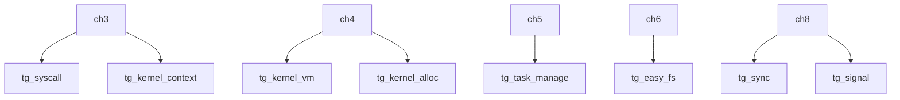

# 组件化 rCore 个性化教学教程

> 基于 Rust + RISC-V 64 的操作系统内核实验教程，结合 AI 辅助学习方法

## 教程简介

本教程是"OS 基本实验 - 组件化 rCore"课程的个性化学习成果，涵盖 ch3～ch8 五个核心章节的内核实现与原理讲解。教程的核心理念是：**借助 AI 工具深入理解 OS 内核，而非绕过学习过程**。

每个章节指导文档包含：
- 背景原理（OS 概念 + 框架设计）
- 关键数据结构说明（含代码片段）
- 实现思路（步骤化）
- AI 协作过程记录
- 书面练习题及参考答案

## 章节结构与学习路径

```
ch3 → ch4 → ch5 → ch6 → ch8
```

| 章节 | 主题 | 核心练习 | 指导文档 |
|------|------|----------|----------|
| ch3 | 多道程序与分时多任务 | sys_trace 系统调用 | [ch3-guide.md](ch3-guide.md) |
| ch4 | 地址空间（Sv39 虚存） | trace 重写 + mmap/munmap | [ch4-guide.md](ch4-guide.md) |
| ch5 | 进程管理 | spawn + stride 调度 | [ch5-guide.md](ch5-guide.md) |
| ch6 | 文件系统 | 硬链接（linkat/unlinkat/fstat） | [ch6-guide.md](ch6-guide.md) |
| ch8 | 并发与同步 | 死锁检测（银行家算法） | [ch8-guide.md](ch8-guide.md) |

各章节在前一章基础上累积扩展，建议按顺序学习。

## 开发环境配置

### 1. 安装 Rust 工具链

```bash
# 安装 rustup
curl --proto '=https' --tlsv1.2 -sSf https://sh.rustup.rs | sh

# 安装 nightly 工具链（rCore 需要）
rustup install nightly
rustup default nightly

# 添加 RISC-V 目标
rustup target add riscv64gc-unknown-none-elf

# 安装必要组件
rustup component add rust-src llvm-tools-preview
```

### 2. 安装 QEMU

```bash
# macOS
brew install qemu

# Ubuntu/Debian
sudo apt-get install qemu-system-misc

# 验证版本（需要 5.0+）
qemu-system-riscv64 --version
```

### 3. 安装其他工具

```bash
# cargo-binutils（生成二进制工具）
cargo install cargo-binutils

# 验证安装
rust-objcopy --version
```

### 4. 克隆项目

```bash
git clone <your-repo-url>
cd 2026s-tg-rcore-nusakom
```

## 快速开始

每个章节的测试方式相同：

```bash
# 进入对应章节目录
cd tg-rcore-tutorial-ch3

# 运行练习测例（交互模式）
cargo run --features exercise

# 自动测试（推荐）
./test.sh exercise

# ch8 可设置超时时间
TIMEOUT_SEC=300 ./test.sh exercise
```

## 文档索引

| 文档 | 说明 |
|------|------|
| [ch3-guide.md](ch3-guide.md) | ch3 实验指导：sys_trace |
| [ch4-guide.md](ch4-guide.md) | ch4 实验指导：虚存 + mmap/munmap |
| [ch5-guide.md](ch5-guide.md) | ch5 实验指导：spawn + stride 调度 |
| [ch6-guide.md](ch6-guide.md) | ch6 实验指导：硬链接 |
| [ch8-guide.md](ch8-guide.md) | ch8 实验指导：死锁检测 |
| [week1-log.md](week1-log.md) | 第一周进度日志 |
| [ai-collaboration.md](ai-collaboration.md) | AI 协作方法论 |
| [evaluation.md](evaluation.md) | 学习效果评估 |

## 框架依赖关系



## 关于 AI 辅助学习

本教程鼓励使用 AI 工具（如 Kiro、Claude、GPT 等）辅助学习，但核心原则是：

- **理解优先**：先理解原理，再让 AI 帮助实现
- **验证思考**：用 AI 验证自己的思路，而非直接要答案
- **记录过程**：将 AI 协作过程记录在周日志中

详见 [ai-collaboration.md](ai-collaboration.md)。
